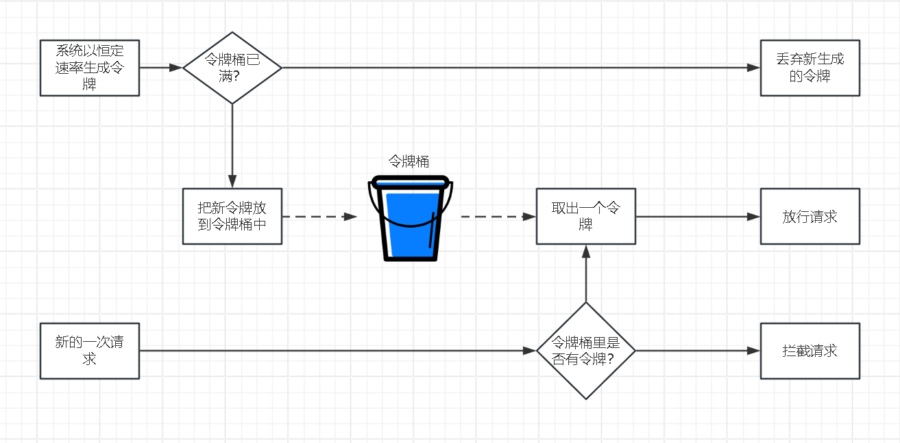
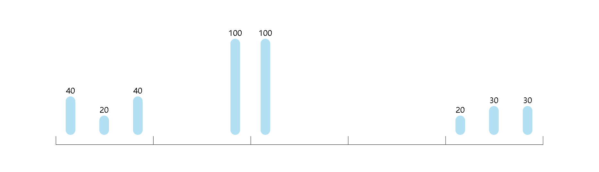
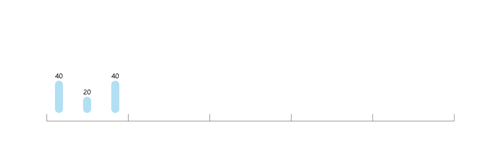
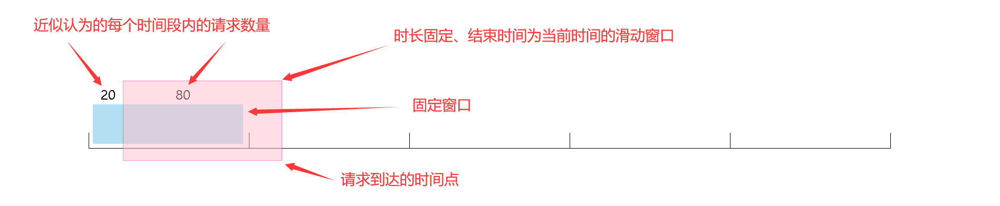

# Hodor

`Hodor` 插件是一个框架内置的**限流器**，可以在请求数量超出了设定值的时候**拦截**新的请求。

## 配置项

- `algorithm` ：限流算法，可选值：令牌桶（默认值）、固定窗口、滑动窗口。
- `urls` ：对哪些路径进行限流，它是一个数组，并且可以使用正则表达式。当数组长度为0时，对所有路径进行限流。
- `time_unit` ：单位时间，以秒为单位，默认值： `60` 。
- `capacity` ：容量，在单位时间内允许的请求数量，如果为 `0` ，表示不限制，默认值： `0` 。
- `ip_capacity` ：每一个 ip 的容量，如果为 `0` ，表示不限制，默认值： `0` 。
- `user_capacity` ：每一个用户的容量，当此值不为 `0` 时，需要通过 `setUserIdGetter` 函数设置一个“从请求体获取用户id”的回调函数。如果为 `0` ，表示不限制，默认值： `0` 。
- `use_real_ip_resolver` ：在使用反向代理的时候，是否通过 `drogon::plugin::RealIpResolver` 插件获得真实的 ip 地址，如果此值为 `true` ，需要同时设置依赖，默认值： `false` 。
- `multi_threads` ：是否要使用 `mutex` 来保证线程安全，默认值： `true` 。
- `rejection_message` ：当请求被拦截的时候，插件内部会生成一个响应，响应状态码是 `429` ，响应体就是这一条配置。
- `limiter_expire_time` ：当插件对不同的 ip 和用户限流时，会针对 ip 地址和用户 id 生成不同的 `RateLimiter` 对象，这一项配置决定了这些对象的过期时间，默认值： `600`。
- `sub_limits` ：对于子路径可以做出更加细致的限制：
  - `urls` ：一个路径数组，可以使用正则表达式，数组长度不可以为 0。
  - `capacity` & `ip_capacity` & `user_capacity` ：针对上一条配置内的路径进行个性化的配置，三条配置不可以同时为 `0` 。
- `trust_ips` ：一个客户端 ip 地址的白名单，支持 IPv4 和 cidr 两种格式。

## 插件提供的一些方法

### setUserIdGetter

- 当 `user_capacity` 配置项不为 `0` 时，必须调用此方法。

* 这个方法用于设置一个可以通过请求体获得用户 id 的函数。
* 只有在执行完 `app().run()` 之后才可以调用此方法，比如：可以在 beginning advice 执行期间调用。

**示例**

仅保留关键代码：

```cpp
app().registerBeginningAdvice([] {
    auto *hodor = drogon::app().getPlugin<drogon::plugin::Hodor>();
    hodor->setUserIdGetter([](const drogon::HttpRequestPtr &req)
                           -> std::optional<std::string> {
        auto session = req->session();
        auto userId = session->get<std::string>("userId");
        if (userId == "")
        {
            return std::nullopt;
        }
        return userId;
    });
});
```

### setRejectResponseFactory

- 此方法可以设置一个通过请求体生成响应体的函数。
- 当此方法被调用设置完回调函数后， `rejection_message` 配置项会失效。
- 只有在执行完 `app().run()` 之后才可以调用此方法，比如：可以在 beginning advice 执行期间调用。

**示例**

仅保留关键代码：

```cpp
drogon::app().registerBeginningAdvice([] {
    auto *hodor = drogon::app().getPlugin<drogon::plugin::Hodor>();
    if (hodor)
    {
        hodor->setRejectResponseFactory(
            [](const drogon::HttpRequestPtr &req)
                -> drogon::HttpResponsePtr {
                Json::Value json;
                json["error"] = "Too Many Requests";
                auto resp = drogon::HttpResponse::newHttpJsonResponse(json);
                resp->setStatusCode(
                    drogon::HttpStatusCode::k429TooManyRequests);
                return resp;
            });
    }
});
```

## 不同的限流算法

### token_bucket：令牌桶算法

**相关概念：**

- 令牌：每一次请求需要消耗一个令牌。
- 令牌桶：一个用于存放令牌的容量固定的容器。
- 令牌生成：每隔固定的时间向令牌桶中添加一个新的令牌，如果令牌桶已满，新生成的令牌会被丢弃。
- 请求处理：对于每一次请求，如果令牌桶里有至少一个令牌，则消耗掉一个令牌并放行请求；如果令牌桶里的令牌数量不足一个，则拦截这次请求。



以上内容是纯概念的东西，实际实现流程一般会把令牌的数量设置为一个 `double` 值，通过两次请求的时间差来计算这段时间内应该生成的令牌数量， `Drogon` 的实现：[TokenBucketRateLimiter](https://github.com/drogonframework/drogon/tree/master/lib/src/TokenBucketRateLimiter.cc)

### fixed_window：固定窗口算法（计数器算法）

统计单位时间内的请求数量，如果达到设定值，拦截后续请求。

假设每一个时间窗口内限流一百次：



可以看到在第二和第三个时间窗口相邻的位置瞬间打入了 `200` 的请求，并没有被限流。

`Drogon` 的实现：[FixedWindowRateLimiter](https://github.com/drogonframework/drogon/blob/master/lib/src/FixedWindowRateLimiter.cc)

### sliding_window：滑动窗口算法

属于一种对固定窗口算法的优化。 `Drogon` 的实现和网上一般找到的算法并不一致。

对于第一个时间窗口，和固定窗口算法处理逻辑一致。



实际上（和一般的滑动窗口算法实现不同）我们并没有细分到更细的时间段，而是仍然将其视为一个整体：


接下来关键的点来了，我们在第二个时间窗口内接收到一次新的请求，我们只计算一个滑动窗口的请求数量，但是实际上我们并没有细分子窗口，所以，这里进行了一个近似处理，认为上一个窗口内的请求是完全平均的。



当然，如果在第二个时间窗口内有请求，也需要和图中的80进行累加，这一部分不需要近似处理。

`Drogon` 的实现：[SlidingWindowRateLimiter](https://github.com/drogonframework/drogon/blob/master/lib/src/SlidingWindowRateLimiter.cc)
