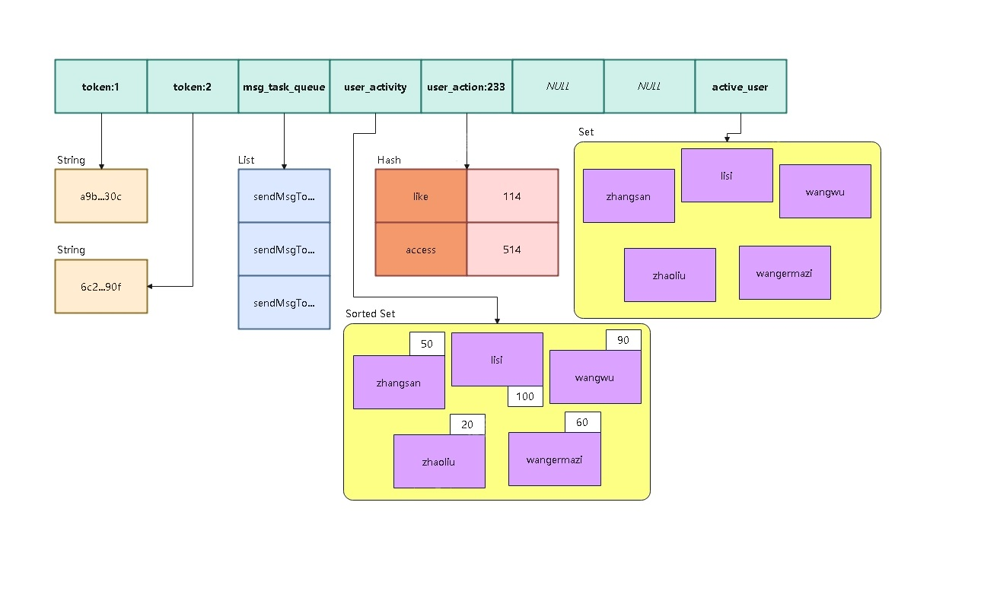

# redis

redis 是一种由 C 语言开发的高性能的 key-value 数据库，它的所有数据都存储在内存中。全局数据采用哈希表进行存储，指定 key ，可以找到对应的 value。

redis 支持五种基本数据类型：String、List、Hash、Set、Sorted Set，分别使用不同的命令进行操作。

关于 redis 的命令可以查看：[Redis中文网](https://redis.net.cn)



## Redis安装

为了方便，这里使用 docker 进行安装：

```shell
docker run -d --name redis
    -p 6379:6379
    -v ~/docker/data/redis:/usr/local/etc/redis
    redis:6.2.8
cd ~/docker/data/redis
echo 'requirepass 123456' >> redis.conf
```

第一条命令创建了一个名为 redis 的 docker 容器，并将容器的 6379 端口映射到宿主机的 6379 端口，同时将宿主机的 `~/docker/data/redis` 目录挂载到容器的 `/usr/local/etc/redis` 目录，并使用 `redis:6.2.8` 镜像启动容器。

第二三条命令，则是创建了一个配置文件，并设置了 redis 的密码为 `'123456'` 。

## 命令行操作redis

1. 连接redis：`redis-cli`；
2. 输入密码：`AUTH 123456` 这里的 `AUTH` 表示 authorization ，即验证密码。

连接到 redis 后，就可以使用 redis 的命令来操作数据了。

我们可以把 redis 的数据整体看成是一个哈希表，键都是字符串，值会存在不同的数据类型，操作不同类型的数据需要使用不同的命令。

有一些命令只可以操作**特定类型**的值，如果使用的命令和实际类型不匹配，会报 WRONGTYPE 错误，比如尝试使用 GET 命令读取 List 数据。

### 对键值对操作

1. KEYS pattern：获取匹配模式的键列表，比如： `KEYS *` 、 `KEYS user:*` ，返回结果是一个列表或者空列表；
2. DEL key：删除指定名称的键，比如： `DEL key1` 、 `DEL user:*` ，返回一个整数，表示被删除的键值对数量。如果不存在指定的键名，会返回整数 `0` 而不是错误；
3. TYPE key：获取指定键存储的值的类型，比如： `YPE key1`、`TYPE user:1` ；
4. EXISTS key：判断指定键是否存在，比如： `EXISTS key1` 、 `EXISTS user:1` ，存在返回 `1` ，不存在返回 `0` 。

### 对字符串的操作

1. SET key value：设置指定键的值，比如：`SET key1 value1`、`SET user:1 admin123`，设置成功的话返回 `OK` ；
2. GET key：获取指定键的值，比如：`GET key1`、`GET user:1`，如果键不存在则返回 `nil` ，如果类型不是字符串会返回一个错误。

### 对列表的操作

1. RPUSH key value1 \[value2\]：从右边插入一个或多个值到指定列表的尾部，比如：`RPUSH list1 value1 value2`，返回一个整数，表示插入后的列表长度，如果指定键存在，但是类型不是列表，那么会返回一个错误；
2. LPOP key：移除并获取列表的第一个元素，比如：`LPOP list1`，如果指定 key 不存在，会返回一个 `nil` ；
3. LLEN key：获取指定列表的长度，比如：`LLEN list1`；
4. LRANGE key start stop：获取指定列表指定范围内的元素，比如：`LRANGE list1 0 -1`，这里的`-1`表示最后一项，类似于 Python。

### 命令格式

是一个由空格隔开的字符串，第一项是命令，后面每一项都是命令的参数。

不同的命令，对参数的数量和格式要求均不一致。

### 返回值类型

- 错误：基本格式为：`(error) ...`，后面会跟上具体错误的类型以及可能的原因，比如 `NOAUTH` 表示没有权限、 `WRONGTYPE` 表示类型错误等。
- 状态：`OK` 、`Stirng` 、`List` 等。
- 字符串：一般是返回尝试获取的值，比如获取字符串的值，或者获取列表里指定的一项（ `LINDEX` 命令）。
- 整数：有时用于表示命令执行成功或失败，有时用于表示列表的长度。
- 列表：获取一个列表，或者获取列表指定下标范围的子列表，还有 `KEYS` 命令等。也包括前面没提到的与集合、有序集合相关的很多命令。
- 空：返回一个 `(nil)`， `GET` 命令指定不存在的键， `LINDEX` 命令指出了超出列表长度的下标范围等。

# drogon操作redis

## 准备工作

### 安装redis开发库依赖

在使用源码安装框架之前，我们需要先安装 `redis` 的开发库依赖。

**Ubuntu 20.04+**

```shell
$ sudo apt-get install libhiredis-dev
```

之后再正常的进行 `drogon` 的安装。

### 修改配置文件

`json` 版本的配置文件：

```json
{
  "redis_clients": [
    {
      // name: 客户端的名字，默认值："default"
      "name": "default",
      // host: 服务器的IP地址，默认值："127.0.0.1"
      "host": "127.0.0.1",
      // port: 服务器的端口号，默认值：6379
      "port": 6379,
      // username: 默认值：""，表示"default"，用于表示ACL中的用户名
      "username": "",
      // passwd: 密码，默认值：""
      "passwd": "123456",
      // db index: 数据库的索引，默认值：0，服务器端默认配置下的取值范围：0-15
      "db": 0,
      // is_fast: 默认值：false，如果设置为 true，这个客户端将会更快，但是用户不能调用它任何同步接口。
      "is_fast": false,
      // number_of_connections: 默认值：1，如果 `is_fast` 设置为true，此项设置意味着每个IO线程拥有的连接数量，否则，此项设置意味着总共的连接数量。
      "number_of_connections": 1,
      // timeout: 默认值：-1.0，以秒为单位，执行命令的过期时间。
      // 负值和零表示没有设置过期时间。
      "timeout": -1.0
    }
  ]
}
```

yaml版本的配置文件：

```yaml
redis_clients:
  # name: 客户端的名字，默认值："default"
  - name: default
    # host: 服务器的IP地址，默认值："127.0.0.1"
    host: 127.0.0.1
    # port: 服务器的端口号，默认值：6379
    port: 6379
    # username: 默认值：""，表示"default"，用于表示ACL中的用户名
    username: ""
    # passwd: 密码，默认值：""
    passwd: "123456"
    # db index: 数据库的索引，默认值：0，服务器端默认配置下的取值范围：0-15
    db: 0
    # is_fast: 默认值：false，如果设置为 true，这个客户端将会更快，但是用户不能调用它任何同步接口。
    is_fast: false
    # number_of_connections: 默认值：1，如果 `is_fast` 设置为true，此项设置意味着每个IO线程拥有的连接数量，否则，此项设置意味着总共的连接数量。
    number_of_connections: 1
    # timeout: 默认值：-1.0，以秒为单位，执行命令的过期时间。
    # 负值和零表示没有设置过期时间。
    timeout: -1.0
```

## 读写数据的同步接口

```cpp
auto redis = app().getRedisClient();
redis->execCommandSync(
    [](const nosql::RedisResult &r) /* -> std::string */ {
        LOG_INFO << r.getStringForDisplaying();
        // ...
    },
    "COMMAND * * *");
```

### RedisResult

`RedisResult` 可以使用 `getStringForDisplaying` 输出一个字符串，与命令行执行结果完全一致。

在 `RedisResult` 类型中，存在一个接口 `type()` ，返回类型是一个枚举 `RedisResultType` ，与命令行里执行 `redis` 命令的结果一一对应。

`RedisResult` 类型也可以使用 `as\*\*\*()` 函数转成各种类型，如果类型不匹配，会抛出异常。

针对 `NIL` 类型，可以用 `isNil()` 简单判断，同时存在一个 `operator bool()` ，只是简单的对 `isNil()` 进行了取反，可以用于检查是否有结果。
